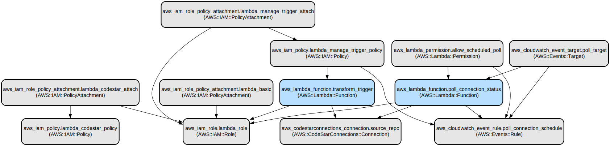

# AWS Transform Automation Infrastructure

This project provides an automated infrastructure setup for AWS Transform that enables automated code modernization through AWS Lambda functions and EventBridge scheduling. It creates a secure, event-driven pipeline that monitors CodeStar connections and triggers transformation jobs automatically.

The infrastructure uses Terraform to provision and manage AWS resources including Lambda functions, IAM roles, EventBridge rules, and CodeStar connections. The solution implements a polling mechanism that checks connection status and automatically triggers transformation jobs when connections become available, reducing manual intervention in the modernization process.

## Repository Structure
```
.
├── main.tf                 # Main Terraform configuration file defining core infrastructure
├── modules/                # Modular infrastructure components
│   ├── iam/               # IAM role and policy definitions
│   │   ├── main.tf       # IAM resource configurations
│   │   └── variables.tf   # IAM module variables
│   └── lambda/            # Lambda function configurations
│       ├── codes/         # Lambda function source code
│       │   ├── poll_connection_status.py   # Connection status monitoring
│       │   └── transform_trigger.py        # Transform job trigger
│       ├── main.tf       # Lambda resource definitions
│       └── variables.tf   # Lambda module variables
├── outputs.tf             # Output definitions for infrastructure deployment
├── variables.tf           # Global variable definitions
└── terraform.tfvars       # Specifying values for global variables 
```

## Usage Instructions
### Prerequisites
- AWS Account with appropriate permissions
- Terraform >= 0.12
- Python 3.9 (Optional)
- AWS CLI configured with appropriate credentials or AWS Configurations in Environment Variables (Access Key and Secret Key required)
- zip utility (for Lambda deployment packages) [Download](http://stahlworks.com/dev/index.php?tool=zipunzip)

### Installation

1. Clone the repository:
```bash
git clone https://github.com/YashKorla2/modernization-automation
```

2. Initialize Terraform:
```bash
terraform init
```

3. Create Lambda deployment packages:
```bash
# For transform trigger
cd modules/lambda/codes
zip -r ../../lambda.zip transform_trigger.py
cd ../../..

# For connection status polling
cd modules/lambda/codes
zip -r ../../lambda_status.zip poll_connection_status.py
cd ../../..
```

### Quick Start

1. Review and plan the infrastructure deployment:
```bash
terraform plan
```

2. Deploy the infrastructure:
```bash
terraform apply
```

3. After deployment, authorize the CodeStar connection in the AWS Console using the URL provided in the outputs.

### Troubleshooting

Common Issues:

1. CodeStar Connection Authorization Failed
- Problem: Connection status remains "PENDING"
- Solution: 
  ```bash
  aws codestar-connections get-connection --connection-arn <connection-arn>
  ```
  Verify authorization in AWS Console

2. Lambda Function Deployment Issues
- Problem: "Error: cannot find lambda.zip"
- Solution: Ensure zip files are created in the correct location:
  ```bash
  cd modules/lambda/codes
  zip -r ../../lambda.zip transform_trigger.py
  ```

## Data Flow
The system implements an event-driven architecture for code transformation automation. It starts with a CodeStar connection and uses EventBridge to trigger Lambda functions that manage the transformation process.

```ascii
[CodeStar Connection] --> [EventBridge Rule (5min)] --> [Poll Lambda] --> [Transform Lambda]
     |                                                        |                    |
     v                                                        v                    v
Connection Status Check <---------------------------- Status Monitoring -----> Transform Job
```

Component Interactions:
1. EventBridge rule triggers poll_connection_status Lambda every 5 minutes
2. Poll Lambda checks CodeStar connection status using boto3
3. When connection is AVAILABLE, poll Lambda triggers transform Lambda
4. Transform Lambda initiates the code transformation job
5. EventBridge rule is disabled after successful connection
6. IAM roles manage permissions between components
7. Status and results are logged to CloudWatch

## Infrastructure



### Lambda Functions
- `poll-connection-status`: Python 3.9 Lambda function that monitors connection status
- `trigger-code-transform`: Python 3.9 Lambda function that initiates transformation jobs

### IAM Resources
- `lambda-code-transform-role`: IAM role for Lambda execution
- `LambdaCodeStarAccessPolicy`: Policy for CodeStar connections access
- `LambdaManageTriggerPolicy`: Policy for Lambda and EventBridge management

### EventBridge
- `poll-connection-schedule`: Rule that runs every 5 minutes to check connection status

### CodeStar
- Connection resource for repository access and authentication